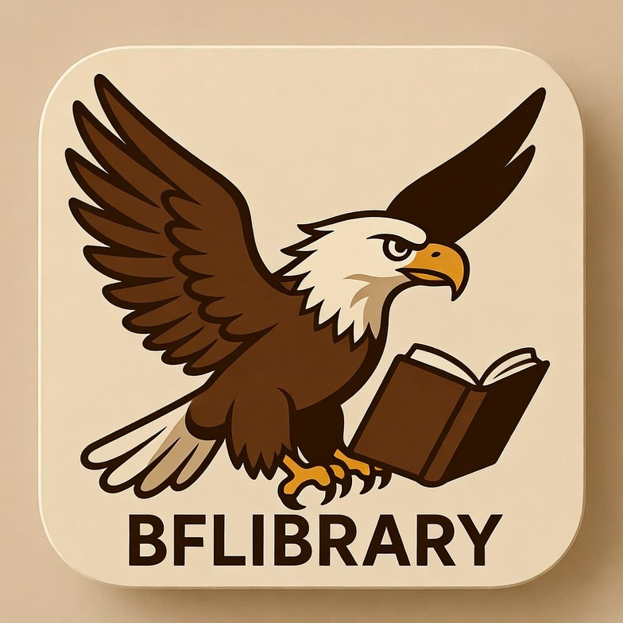

# bflibrary

  

A personal library of cheatsheets for AI books — quick references distilled from the source books in this repo.

## Books

Source books (`books/`):

- `mytransformer.pdf`
- `mypython.pdf`
- `mytorch.pdf`
- `mydeeplearning.pdf`
- `myrust.pdf`
- `mykafka.pdf`
- `myzig.pdf`
- `myllamacpp.pdf`

## Cheatsheets

Quick-reference cheatsheets (`cheatsheet/`):

- `tmux_cheatsheet.pdf`
- `PyTorch_Cheatsheet.pdf`
- `psql_cheatsheet.pdf`
- `zig_vibecoding_cheatsheet.pdf`
- `zig_cheatsheet.pdf`
- `drizzle-postgres-cheatsheet.pdf`
- `claude_code_cheatsheet.pdf`
- `Rust_Cheatsheet.pdf`
- `kafka_python_cheatsheet.pdf`
- `python_cheatsheet.pdf`
- `Claude_Excel_Cheatsheet.pdf`

## License

See [LICENSE](LICENSE).
